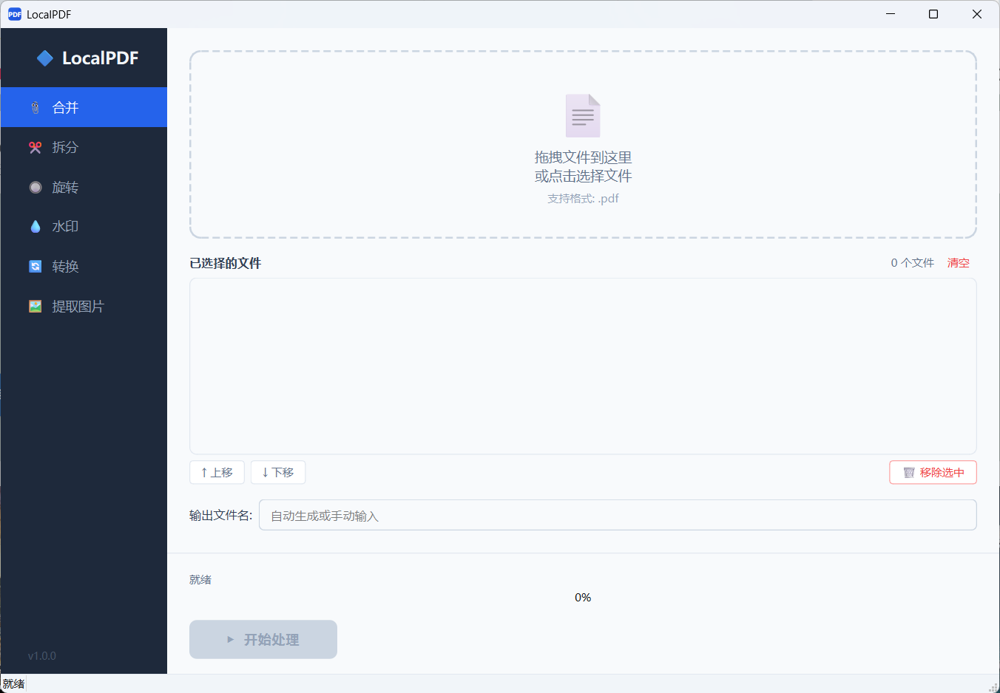

# 🔷 LocalPDF — 纯本地 PDF 工具箱

> **100% 本地处理 · 零网络请求 · 零隐私泄露 · 完全免费 · 无广告无水印**

<p align="center">
  
</p>

---

## ✨ 功能一览

| 功能              | 说明                                                             |
| ----------------- | ---------------------------------------------------------------- |
| 📎 **合并 PDF**   | 多个 PDF 合并为一个，支持拖拽排序                                |
| ✂️ **拆分 PDF**   | 按页码范围 / 每N页 / 拆成单页，按页码命名                        |
| 🔘 **旋转 PDF**   | 90° / 180° / 270°，支持全部页面或指定页码                        |
| 💧 **加水印**     | 文字水印（支持中文）/ 图片水印，平铺/居中/角落，可调角度、透明度 |
| 🔄 **PDF ↔ 图片** | PDF 转 PNG/JPG/TIFF，图片转 PDF，可调 DPI                        |
| 🖼️ **提取图片**   | 从 PDF 中提取所有嵌入的图片（位图）                              |

---

## 🖥️ 界面预览

<p align="center">
  
</p>

---

## 🚀 快速开始

### 方式一：下载 Release（推荐）

1. 前往 [Releases](../../releases) 页面下载最新版
2. 解压 `LocalPDF.zip`
3. 双击 `LocalPDF.exe` 即可使用

### 方式二：从源码运行

```bash
# 克隆项目
git clone https://github.com/your-username/localpdf.git
cd localpdf

# 安装依赖
pip install -r requirements.txt

# 运行
python main.py
```

---

## 📖 使用说明

### 📎 合并 PDF

1. 点击左侧「合并」
2. 拖入多个 PDF 文件（或点击选择）
3. 在文件列表中拖拽调整顺序（或用上移/下移按钮）
4. 自定义输出文件名（可选）
5. 点击「▶ 开始处理」

### ✂️ 拆分 PDF

1. 点击左侧「拆分」
2. 拖入 PDF 文件
3. 选择拆分模式：
   - **按页码范围**：输入如 `1-3, 5, 8-10`
   - **每N页拆分**：设置每多少页一个文件
   - **拆成单页**：每页生成一个独立 PDF
4. 点击「▶ 开始处理」
5. 输出文件按页码自动命名（如 `xxx_p0001-0003.pdf`）

### 🔘 旋转 PDF

1. 点击左侧「旋转」
2. 拖入 PDF 文件
3. 选择旋转角度（90°/180°/270°）
4. 选择应用范围（全部页面 / 指定页码）
5. 点击「▶ 开始处理」

### 💧 加水印

1. 点击左侧「水印」
2. 拖入 PDF 文件
3. 选择水印类型：
   - **文字水印**：输入文字（支持中文）、设字号、颜色、透明度、角度、位置
   - **图片水印**：选择水印图片、设缩放、透明度、角度、位置
4. 位置模式：
   - **平铺**：满页重复（配合角度可实现斜向铺满）
   - **居中**：页面正中
   - **角落**：右下角
5. 点击「▶ 开始处理」

### 🔄 PDF ↔ 图片

**PDF → 图片：**

1. 选择输出格式（PNG/JPG/TIFF）和 DPI（72/150/200/300）
2. 每页生成一张图片

**图片 → PDF：**

1. 拖入多张图片
2. 选择页面大小（自适应/A4/Letter）
3. 所有图片合并为一个 PDF

### 🖼️ 提取图片

1. 点击左侧「提取图片」
2. 拖入 PDF 文件
3. 选择输出格式（保持原格式 / 转 PNG / 转 JPG）
4. 点击「▶ 开始处理」
5. 自动提取 PDF 中所有嵌入的图片对象

> **注意**：只能提取 PDF 中以位图形式嵌入的图片。纯矢量绘制的图形（如架构图、流程图）无法提取，因为它们在 PDF 中不是图片对象。

---

## 🛠️ 技术栈

| 层级             | 技术                    | 版本   | 用途                                      |
| ---------------- | ----------------------- | ------ | ----------------------------------------- |
| **GUI 框架**     | PySide6 (Qt for Python) | ≥ 6.6  | 原生跨平台桌面 UI，支持高 DPI、拖拽、动画 |
| **PDF 核心引擎** | PyMuPDF (fitz)          | ≥ 1.23 | PDF 读写、渲染、图片提取、水印、压缩      |
| **辅助 PDF 库**  | pypdf                   | ≥ 4.0  | 合并、拆分、旋转（更稳定的页面操作）      |
| **图像处理**     | Pillow                  | ≥ 10.0 | 图片格式转换、压缩、缩放                  |
| **进度通信**     | QThread + Signal/Slot   | -      | 后台线程执行耗时操作，防止 UI 卡顿        |
| **打包工具**     | PyInstaller             | ≥ 6.0  | 打包为 Windows 可执行文件                 |

### 项目结构

```
localpdf/
├── main.py                    # 入口文件
├── requirements.txt           # 依赖清单
├── pyproject.toml             # 项目配置
├── README.md
├── assets/
│   ├── logo.svg               # 应用 Logo
│   └── styles/
│       └── main.qss           # 全局 QSS 样式表
├── src/
│   ├── app.py                 # QApplication 初始化 + 主题加载
│   ├── ui/
│   │   ├── main_window.py     # 主窗口：左侧导航 + 右侧工作区
│   │   ├── components/
│   │   │   ├── drop_zone.py   # 通用拖拽上传组件
│   │   │   ├── file_list.py   # 文件列表（支持拖拽排序）
│   │   │   ├── progress_bar.py# 通用进度条
│   │   │   └── toast.py       # 右下角通知弹窗
│   │   └── pages/
│   │       ├── base_page.py       # 功能页面基类
│   │       ├── merge_page.py      # 合并 PDF
│   │       ├── split_page.py      # 拆分 PDF
│   │       ├── rotate_page.py     # 旋转 PDF
│   │       ├── watermark_page.py  # 加水印
│   │       ├── convert_page.py    # PDF ↔ 图片
│   │       └── extract_page.py    # 提取图片
│   ├── core/
│   │   └── errors.py          # 自定义异常 + 日志
│   ├── workers/
│   │   └── pdf_worker.py      # QThread 后台线程
│   └── utils/
│       ├── file_utils.py      # 文件路径工具
│       └── validators.py      # 输入校验
├── tests/                     # 单元测试
└── build/
    ├── build.ps1              # PowerShell 打包脚本
    └── build.bat              # 一键打包入口
```

### 架构设计

```
┌─────────────────────────────────────────────┐
│                   UI 层                      │
│  MainWindow → BasePage → 各功能 Page         │
│  组件: DropZone / FileList / ProgressBar     │
├─────────────────────────────────────────────┤
│                 线程层                       │
│  PDFWorker (QThread) → Signal/Slot 通信      │
├─────────────────────────────────────────────┤
│                 核心层                       │
│  PyMuPDF (fitz) + pypdf + Pillow            │
├─────────────────────────────────────────────┤
│                 工具层                       │
│  validators / file_utils / errors / logger  │
└─────────────────────────────────────────────┘
```

- **UI 层**：PySide6 构建，左侧导航栏 + 右侧 QStackedWidget 切换功能页面
- **线程层**：所有耗时操作在 QThread 子线程执行，通过 Signal/Slot 更新进度条
- **核心层**：PyMuPDF 处理渲染/水印/压缩，pypdf 处理合并/拆分/旋转
- **工具层**：文件校验、路径处理、异常定义、日志记录

---

## 🧪 运行测试

```bash
pip install pytest
python -m pytest tests/ -v
```

测试覆盖：合并、拆分、旋转、水印、转换、提取图片、工具函数、输入校验。

---

## 📋 系统要求

- **操作系统**：Windows 10/11（64位）
- **Python**：≥ 3.10（源码运行时）
- **磁盘空间**：打包后约 50MB

---

## 🤝 贡献

欢迎提交 Issue 和 Pull Request！

1. Fork 本项目
2. 创建功能分支：`git checkout -b feature/xxx`
3. 提交更改：`git commit -m 'Add xxx'`
4. 推送分支：`git push origin feature/xxx`
5. 创建 Pull Request
